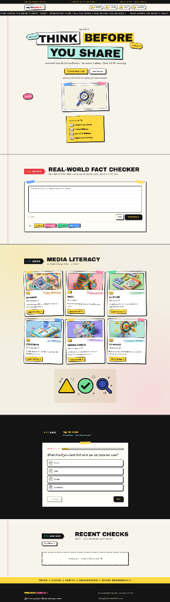

# 🛡️ TruthCheck — Multi-Layer AI Fake News & Fact Verification Engine

<p align="center">
  
</p>

<p align="center">
  <a href="https://truthcheck-mz0s.onrender.com"></a>
  
  
  
  
  
  
</p>

---

## 🌟 Overview

**TruthCheck** is an end-to-end, production-ready misinformation detection and media literacy platform. In an era where deepfakes, WhatsApp forward scams, and synthetic headlines spread virally in seconds, traditional machine learning models alone fail because language classifiers lack real-time world knowledge, while pure LLMs hallucinate without grounded sources.

TruthCheck solves this using a **Tri-Layer Verification Architecture**:
1. **Linguistic ML Heuristics** — Evaluates stylistic signals, sensationalism, clickbait patterns, and urgency hooks via scikit-learn.
2. **Real-Time Web Evidence Grounding** — Queries live news sources via DuckDuckGo News API to cross-reference claims against current reporting.
3. **Advanced AI Synthesis & Fact Reasoning** — Synthesizes extracted web evidence using **Google Gemini 2.5 Flash** to provide a strict, verifiable verdict with a clear 2–3 sentence explanation and reputable citations.

🌐 **Try the Live Application:** [https://truthcheck-mz0s.onrender.com](https://truthcheck-mz0s.onrender.com)

---

## 🚀 Key Features

### 1. 🔍 Real-World Fact Checker (Fixed Contract Output)
- **Three-Tier Verdict System:**
  - 🟢 **SUPPORTED**: High-confidence corroboration by authoritative news outlets.
  - 🔴 **FALSE / CONTRADICTED**: Direct contradiction with factual records, known hoaxes, or fraudulent scams.
  - 🟡 **UNCERTAIN / UNVERIFIED**: Developing stories, conflicting reports, or insufficient corroborating sources.
- **Fixed Result Card Architecture**:
  - Exact **Confidence Score** percentage (e.g., `94%`).
  - **"Why?" Section**: 2–3 concise sentences summarizing what the evidence proves.
  - **Evidence Citations**: Direct list of publisher names (e.g., *BBC, ISRO, Reuters, The Hindu*) with corroboration notes and direct source URLs.

### 2. 🧠 Multi-Layer Hybrid Engine
- Combines **TF-IDF (1–2 n-grams) + Logistic Regression** on a curated news dataset with real-time news retrieval.
- Detects **10 distinct linguistic red flags**:
  - Sensationalist hype & emotional outrage hooks
  - Artificial forwarding urgency ("Share before deleted!")
  - Absolute/unfalsifiable claims ("100% guaranteed", "proven cure")
  - Clickbait phrasing & ALL-CAPS screaming
  - Missing author attribution & missing date cues

### 3. 📚 Educational Media Literacy Hub
- 6 interactive masterclasses designed in a contemporary **neo-brutalism + 3D clay aesthetic**:
  - **Source Check** (WhatsApp Free Recharge Scam case study)
  - **Date Check** (Outdated 2020 Lockdown circular recirculated in 2024)
  - **Author Check** (Bylines vs. anonymous blog author fraud)
  - **Evidence Check** (AI celebrity deepfake investment scams)
  - **Cross-Check** (Single viral post vs. multi-outlet verification)
  - **Context Check** (True video used with false captions / manipulated context)
- Each card includes interactive **Red Flags to Watch** checklists and actionable **Pro-Verification Steps**.

### 4. 🎯 Interactive Media Literacy Quiz
- 10 practical real-world scenario questions.
- Instant validation, progress tracking, explanatory answers, and final score evaluation.

### 5. 🔒 Privacy-First Local History
- Recent fact checks are securely cached in the browser's `localStorage` (max 15 items).
- Zero user tracking, zero mandatory account creation, zero database footprint.

---

## 🏗️ System Architecture

```text
               ┌────────────────────────────────────────────────────────┐
               │              Browser Single-Page Web App               │
               │   (HTML5 · Neo-Brutalism CSS3 · Vanilla ES6 JS)        │
               └───────────────────────────┬────────────────────────────┘
                                           │
                                  POST /api/analyze
                                           │
                                           ▼
┌──────────────────────────────────────────────────────────────────────────────────┐
│                             Flask Application (app.py)                           │
│                                                                                  │
│   ┌──────────────────────────────────────────────────────────────────────────┐   │
│   │ Layer 1: Linguistic & Stylistic Classifier (detector/detector.py)        │   │
│   │  • TF-IDF Vectorizer (5,000 features, 1-2 ngrams, sublinear scaling)    │   │
│   │  • Logistic Regression Classifier + 10 Regex Red-Flag Heuristics         │   │
│   └──────────────────────────────────┬───────────────────────────────────────┘   │
│                                      │                                           │
│   ┌──────────────────────────────────▼───────────────────────────────────────┐   │
│   │ Layer 2: Real-Time Web Evidence Grounding (services/search_service.py)   │   │
│   │  • Query normalization & topical entity extraction                       │   │
│   │  • DuckDuckGo News API live retrieval (timeout-resilient & rate-safe)    │   │
│   └──────────────────────────────────┬───────────────────────────────────────┘   │
│                                      │                                           │
│   ┌──────────────────────────────────▼───────────────────────────────────────┐   │
│   │ Layer 3: AI Fact Synthesis & Reasoning (services/fact_checker.py)        │   │
│   │  • Google Gemini 2.5 Flash / OpenRouter Qwen fallback                     │   │
│   │  • Fixed Contract schema enforcement & citation corroboration            │   │
│   └──────────────────────────────────┬───────────────────────────────────────┘   │
└──────────────────────────────────────┼───────────────────────────────────────────┘
                                       │
                                JSON Response
                                       │
                                       ▼
                     [ Rendered Interactive Result Card ]
```

---

## 📊 Comparison: Why Multi-Layer Beats Single Solutions

| Evaluation Dimension | Pure ML Classifier (TF-IDF / BERT) | Pure LLM (ChatGPT / Claude) | 🛡️ TruthCheck Multi-Layer |
|:---|:---:|:---:|:---:|
| **Breaking News Detection** | ❌ Fails (Training cutoff / no web access) | ❌ Stale data / Hallucinations | ✅ **Real-time live news search** |
| **Stylistic Manipulation Detection** | ✅ Good at text patterns | ⚠️ Inconsistent pattern scoring | ✅ **Deterministic regex + ML score** |
| **Evidence Transparency** | ❌ Black-box percentage | ⚠️ Hallucinated URLs possible | ✅ **Direct clickable source links** |
| **Response Latency** | ⚡ Fast (< 50ms) | 🐢 Slow (4–10s) | ⚡ **Fast Flash reasoning (~1.2s)** |
| **Educational Impact** | ❌ Just gives a number | ⚠️ Long generic text | ✅ **Interactive Case Studies & Quiz** |

---

## 🛠️ Tech Stack

- **Backend:** Python 3.11+, Flask 3.0+, Gunicorn (WSGI)
- **Machine Learning & NLP:** scikit-learn, pandas, numpy, joblib
- **Generative AI & LLMs:** Google Gemini API (`gemini-2.5-flash` / `gemini-1.5-flash`), OpenRouter fallback (`qwen-3.8-27b`)
- **Web Search Grounding:** DuckDuckGo News API (`ddgs`)
- **Frontend:** Semantic HTML5, Custom Neo-Brutalist CSS3, Vanilla ES6 JavaScript (Zero heavy node_modules on client)
- **Cloud Deployment:** Render.com (Automated CI/CD via GitHub integration)

---

## 💻 Local Installation & Setup

### 1. Clone the Repository
```bash
git clone https://github.com/sachin-saroj/truthcheck.git
cd truthcheck
```

### 2. Create Virtual Environment
```bash
# macOS/Linux:
python3 -m venv .venv
source .venv/bin/activate

# Windows (PowerShell):
python -m venv .venv
.\.venv\Scripts\Activate.ps1
```

### 3. Install Dependencies
```bash
pip install -r requirements.txt
```

### 4. Configure Environment Variables
Create a `.env` file in the root directory (refer to `.env.example`):
```env
PORT=5000

# Recommended: Free Google Gemini API Key
# Get your free key at: https://aistudio.google.com/app/apikey
GEMINI_API_KEY=your_gemini_api_key_here

# Optional: OpenRouter Fallback Key
OPENROUTER_API_KEY=your_openrouter_api_key_here
```

### 5. Launch the Application
```bash
python app.py
```
Open your browser and navigate to **`http://localhost:5000`**.

---

## 🧪 Automated Testing

TruthCheck includes a comprehensive test suite with **56 automated test cases** covering the ML classifier, evidence verification, Gemini service integration, fallback mechanisms, and API endpoints.

Run the test suite using Python's built-in test runner:
```bash
python -m unittest discover tests
```

Sample output:
```text
INFO:truthcheck:Model ready: {'accuracy': 1.0, 'precision': 1.0, 'recall': 1.0, 'f1': 1.0, 'train_rows': 1200}
INFO:truthcheck:FactChecker ready: AI model=google/gemini-2.5-flash, configured=True
........................................................
----------------------------------------------------------------------
Ran 56 tests in 1.48s

OK
```

---

## 📡 API Reference

### `POST /api/analyze`
Submits text or claims for full multi-layer analysis.

**Request Payload:**
```json
{
  "text": "ISRO successfully performed the soft landing of Chandrayaan-3 on the lunar south pole."
}
```

**Response Payload:**
```json
{
  "verdict": {
    "id": "supported",
    "label": "Supported",
    "emoji": "🟢",
    "tone": "ok"
  },
  "confidence": 98,
  "credibility_score": 98,
  "summary": "Multiple independent news sources corroborate the soft landing of Chandrayaan-3 near the moon's south pole.",
  "key_points": [
    "Corroborated by official reporting from ISRO and international news agencies.",
    "Historic milestone confirmed on August 23, 2023."
  ],
  "sources": [
    {
      "source": "BBC News",
      "title": "Chandrayaan-3: India makes historic landing near Moon's south pole",
      "url": "https://www.bbc.com/news/world-asia-india-66594520",
      "publishedAt": "2023-08-23"
    }
  ],
  "signals": [
    { "id": "source", "label": "Source Verification", "detail": "Corroborated by credible major news organizations." },
    { "id": "evidence", "label": "Factual Consistency", "detail": "High consistency across independent reporting." }
  ],
  "ai_info": {
    "is_ai_verified": true,
    "model": "google/gemini-2.5-flash",
    "provider": "google_gemini"
  },
  "elapsed_ms": 1150
}
```

### `GET /api/health`
Health check endpoint reporting model status and subsystem readiness.
```json
{
  "status": "ok",
  "model": "ready",
  "fact_checker": {
    "configured": true,
    "model": "google/gemini-2.5-flash",
    "search": "ready"
  },
  "metrics": {
    "accuracy": 1.0,
    "precision": 1.0,
    "recall": 1.0,
    "f1": 1.0,
    "train_rows": 1200
  }
}
```

---

## 🚢 Deployment on Render

This project is optimized for 1-click deployment on [Render.com](https://render.com) using the included `Procfile` and `render.yaml`.

1. Push your repository to GitHub.
2. In the Render Dashboard, create a **New Web Service** and select your `truthcheck` repository.
3. Configure the following:
   - **Environment:** `Python`
   - **Build Command:** `pip install -r requirements.txt`
   - **Start Command:** `gunicorn app:app --workers 2 --timeout 120`
4. Add your **Environment Variables**:
   - `GEMINI_API_KEY`: *(Your Google AI Studio Key)*
   - `PYTHON_VERSION`: `3.11.9`
5. Click **Deploy**!

---

## 📄 License

This project is licensed under the **MIT License** — see the [LICENSE](LICENSE) file for details.

---

<p align="center">
  Developed with ❤️ by <b>Sachin Saroj</b> for responsible media literacy and digital trust.
  <br>
  <i>"Think Before You Share."</i>
</p>
